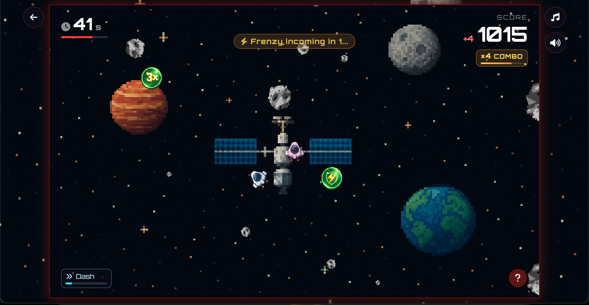

# Zsasteroids

A fast-paced, browser-based take on the classic **Asteroids** arcade game, built
with vanilla JavaScript and the HTML5 Canvas.



🎮 **Live:** [zsasteroids.com](https://zsasteroids.com)

---

## Overview

Zsasteroids is a single-page arcade game with **no build step and no framework** —
just ES modules, a canvas, and Firebase as the backend. You fly a ship, shoot
asteroids, chain combos, dodge a hunter drone, and try to score as high as you
can before the 60-second timer runs out. Sign in with Google to keep a profile,
or play as a guest. There is also a **2-player co-op mode** where two players
share one match and one score, and can revive each other when they go down (the
screenshot above is a live co-op round).

---

## Tech stack

| Layer | Choice | Notes |
|---|---|---|
| Rendering / logic | Vanilla JavaScript (ES modules) | No bundler, no transpiler |
| Graphics | HTML5 Canvas | Fixed 1920×1080 logical resolution, CSS-scaled |
| Backend / data | Firebase Realtime Database | Persistent store **and** real-time message bus |
| Auth | Firebase Authentication | Google sign-in; anonymous guests supported |
| Analytics | Google Analytics, Hotjar | — |
| Hosting | Custom domain (`zsasteroids.com`) | Static hosting, **not** Firebase Hosting |

The browser loads the ES modules directly and pulls the Firebase SDK from the
Google CDN (`gstatic.com`). There is nothing to compile.

---

## Where it runs

Everything runs **client-side in the browser**. The only server-side component is
Firebase: the Realtime Database stores leaderboards and profiles, and Firebase
Authentication handles Google sign-in. The static files (HTML, CSS, JS, assets)
are served from a custom domain rather than Firebase Hosting, so the auth flow
uses the Firebase project's `authDomain` and the site's domain is listed under
the project's Authorized Domains.

Because there is no build pipeline, any static file server can serve the project
root as-is — the same files that live in this repository are what run in
production.

---

## Architecture

**Client-only, with Firebase as the only backend.** All game logic lives in the
browser. Firebase Realtime Database plays two roles: a persistent store (scores,
profiles) and a real-time **message bus** for multiplayer.

**Game loop.** A `requestAnimationFrame` loop drives everything. Entities live in
shared `updatable` / `drawable` arrays; each frame updates positions, resolves
collisions, draws the world (with screen-shake and particle effects), and renders
the HUD as a DOM overlay on top of the canvas.

**Multiplayer is host-authoritative.** In a co-op match the **host** runs the
"real" simulation — it spawns asteroids, resolves collisions, and owns the shared
score. The **guest** is a thin client: it sends its own input/position and renders
the host's world state. The Realtime Database is the channel between the two
clients. A few techniques keep it responsive on a free-tier database:

- **Throttled sync** — positions ~20×/s, the world snapshot ~11×/s.
- **Optimistic prediction** — the guest plays its own hit explosions instantly
  instead of waiting for the host round-trip; the host still validates the hit
  and owns the authoritative score.
- **Heartbeat + timeout** — each client writes a periodic heartbeat; if a partner
  stops updating, the other is cleanly returned to the menu ("Player N
  disconnected").

**Singleplayer compatibility.** Every multiplayer code path is gated behind an
`isMultiplayer` check, so the solo flow is unaffected.

---

## Project structure

The codebase is organized by responsibility: gameplay entities, the app/UI shell
(home + profile pages), the Firebase layer, and the multiplayer layer.

```
asteroids_game_js/
├── index.html              # Home page: hero, leaderboards, solo/co-op modals, auth bar
├── profile.html            # Profile page: avatar, stats, personal top-3
├── new_design.css          # Shared styles for the home and profile pages
├── database.rules.json     # Firebase Realtime Database security rules (source of truth)
├── package.json
│
├── js/                     # ── Gameplay ──
│   ├── main.js             # Core game: loop, input, scoring, collisions, multiplayer
│   ├── player.js           # Player ship: movement, shooting, dash, power-ups
│   ├── asteroid.js         # Asteroid entity + split / explosive logic
│   ├── asteroidfield.js    # Asteroid spawner
│   ├── shot.js             # Projectiles
│   ├── powerup.js          # Boost / multishot / shield power-ups
│   ├── strike.js           # Strike hazard
│   ├── hunter.js           # Hunter drone enemy
│   ├── circleshape.js      # Base circle-collision class
│   ├── effects.js          # Particles, screen shake, score pops (game "juice")
│   ├── constants.js        # Game constants (resolution, speeds, tuning)
│   ├── global.js           # Shared globals / helpers
│   │                       # ── App / UI ──
│   ├── firebase.js         # Firebase client init + exports (DB + Auth)
│   ├── auth.js             # Google sign-in/out, profile creation, auth state
│   ├── index.js            # Home-page logic (modals, co-op flow, auth UI)
│   ├── profile.js          # Profile-page logic (auth guard, render, personal top-3)
│   ├── main_firebase.js    # Single-player leaderboard fetch (home page)
│   ├── mp_firebase.js      # Co-op leaderboard fetch (home page)
│   │                       # ── Multiplayer ──
│   ├── lobby.js            # Lobby CRUD (create / join / delete / listen)
│   ├── remote_player.js    # Renders the partner ship (draw + interpolation only)
│   │                       # ── Audio / misc ──
│   ├── soundManager.js     # Sound playback, mute, variants
│   ├── music_toggle.js     # Background-music toggle
│   ├── click_sound.js      # Button click sounds
│   ├── click_sound_delayed.js
│   ├── flying_background.js # Animated particle background (home + profile)
│   └── themes_background_music.js
│
├── assets/
│   ├── audio/              # Sound effects (.mp3)
│   ├── fonts/              # AquaGrotesque, Fenwick-Outline
│   ├── images/            # Icons, branding, gameplay screenshot
│   └── videos/
│
└── themes/                 # One folder per theme (HTML, CSS, sprites, music)
    ├── space/              # Active theme — ship, asteroids, power-ups, hunter, music
    ├── ocean/              # Scaffolded (locked)
    ├── jungle/             # Scaffolded (locked)
    ├── ww2/                # Scaffolded (locked)
    └── city/               # Scaffolded (locked)
```

---

## Data model (Firebase Realtime Database)

```
users/{uid}            → username, createdAt, stats { totalGames, bestScore, totalScore }
usernames/{name}       → uid                 (uniqueness / availability)
scores/{pushId}        → score, name, uid?   (single-player global leaderboard)
mpScores/{pushId}      → score, name         (co-op leaderboard, "A + B")
lobbies/{roomCode}     → host, guest, theme, status, score, players/, asteroids/, …
                         (live co-op state; also the real-time message bus)
```

---

## Security model

- **No secrets in the repo.** The Firebase web config (apiKey, etc.) is a public
  client identifier by design — access is controlled by Firebase Authentication
  and the Database Rules, not by keeping the config secret.
- **Database Rules enforce integrity** (`database.rules.json`): leaderboard
  entries are **write-once**, score-capped, and type/length-validated; a signed-in
  score cannot impersonate another user's `uid`; users can only read/write their
  own profile and stats; usernames are uniquely claimed.
- **Serverless trade-off.** With no game server, the score cap in the rules is the
  primary anti-cheat guard; full server-side score validation is intentionally out
  of scope for this client-only build.

> `database.rules.json` is the source of truth for the rules and must be published
> in the Firebase Console to take effect.

---

## License

All Rights Reserved — see [LICENSE](LICENSE). The source is published for
reference only; it may not be reused, redistributed, or deployed without
permission.
